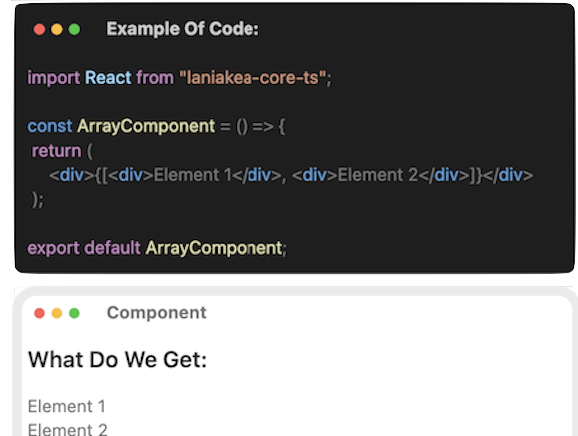
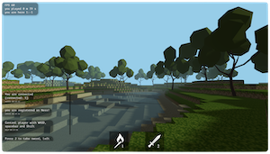
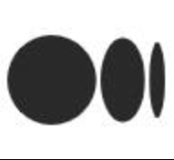
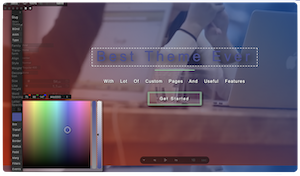

  <h1>Projects:</h1>

  <table>
    <tr>
      <td>
        
Own React (The React Clone).

        
        

           
           
          
        
 
      </td>
      <td>
        
Maincraft 3D Game (The Mincraft Clone)

        
        
  
          
        

      </td>
    </tr>
    <tr>
      <td>
        
Animation & WordPress Theme Builder

        
        
private repo:

        

          
            
          
        

      </td>
    </tr>
  </table>

  <!---->
  
    
  
  
  
    
  
  
  

<!--
<h1>
    Hey there
    
</h1>

- 🔭 I’m currently working on ...
- 🌱 I’m currently learning ...
- 👯 I’m looking to collaborate on ...
- 🤔 I’m looking for help with ...
- 💬 Ask me about ...
- 📫 How to reach me: ...
- 😄 Pronouns: ...
- ⚡ Fun fact: ...
-->
