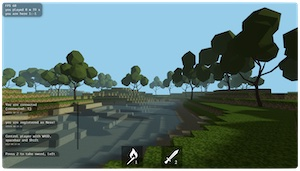
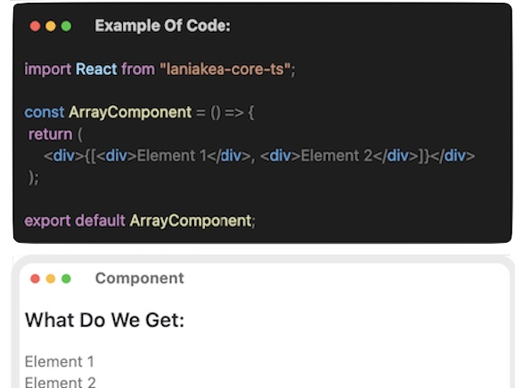
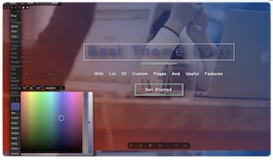

    
  
  

  

  <h1>PROJECTS:</h1>

  <table>
    <tr>
      <td>
        <h2>Minecraft 3D Net Game</h2>
        

          TS, Three.js, Nodejs, Express, Sockets, REST API...
            
          
           
            
            
          Deploy: <a href="https://rsclone-minecraft.netlify.app/">Project example</a>
        

      </td>
      <td>
        <h2>English Audio Books</h2>
        

          TS, React, Redux, Thunk, RTK query, Nodejs, Express, Auth, JWT, REST API, Tests (Unit, Integr, Screenshots), Storybook, CI/CD...
            
          
           
           
            
          Deploy: <a href="https://stored-books.netlify.app/">Project example</a>
        

      </td>
    </tr>
    <tr>
      <!-- <td>
        <h2>Internet Store</h2>
        

          TS, React, Redux, Thunk, RTK query, Nodejs, Express, Auth, JWT, REST API, Tests (Unit, Integr, RTL, Screenshots), Storybook, CI/CD...
            
          
           
          
        

      </td> -->
      <td>
        <h2>Own Frameworks and Libraries</h2>
        

          TS, Nodejs, making own NPM package
        

        
        

          Git: <a href="https://github.com/addamsv/laniakea-core-ts/">Own React</a>
           
          NPM repo: <a href="https://www.npmjs.com/package/laniakea-core-ts" title="npmjs module">React NPM lib</a>
           
          Git: <a href="https://github.com/addamsv/laniakea-core-ts/tree/prod-state-manager">Own Redux</a>
           
          Git: <a href="https://github.com/addamsv/laniakea-core-ts/tree/prod-query-api">Own Axios</a>
           
           
          Deploy: <a href="https://the-react-clone.netlify.app/">Project example</a>
           
        
 
      </td>
      <td>
        <h2>HTML, CSS, Animation Maker & WordPress Theme Builder</h2>
        

          TS, React, Redux, RTK query, REST API, NodeJS Express, CI/CD...
        

        
        

         

          Description: <a href="https://addamsv.github.io/addamsv/projects/lania/index.html">Site</a>
         

         <!--   
          -->
        

      </td>
    </tr>
  </table>

  

  <!--
  
    -->

  
  

<!--
<h1>
    Hey there
    
</h1>

- 🔭 I’m currently working on ...
- 🌱 I’m currently learning ...
- 👯 I’m looking to collaborate on ...
- 🤔 I’m looking for help with ...
- 💬 Ask me about ...
- 📫 How to reach me: ...
- 😄 Pronouns: ...
- ⚡ Fun fact: ...
-->
