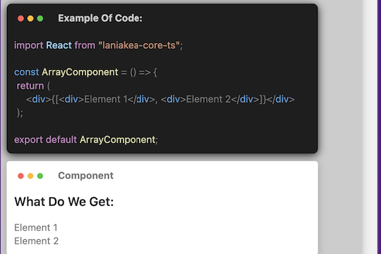
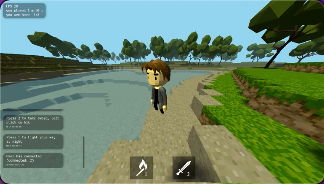

  

<h1 align="center">Sergey Adamovich</h1>

<h3 align="center">Curriculum Vitae (CV) as <b>Frontend Developer</b></h3> 

  Location: Minsk, Belarus
   
  &nbsp;&nbsp;&nbsp;&nbsp;
  &nbsp;&nbsp;&nbsp;&nbsp;
  &nbsp;&nbsp;&nbsp;&nbsp;
  

<!--
https://by.linkedin.com/in/sergey-adamovich-37241421b?trk=people-guest_people_search-card
-->

 

<h1 align="center">TECHNICAL EXPERTISE</h1>

  <h3 align="center">FrontEnd</h3>
    &nbsp;<b>Basics:</b> HTML, CSS, Preprocessors, JS, TS 
    &nbsp;<b>Libs & Frameworks:</b> React, (Angular & Vue basic knowledge), Laniakea, RxJS, Redux, MobX  
  
  <h3 align="center">BackEnd</h3>
    &nbsp;<b>Node.js:</b> Express, Nest.js (Nest-CLI, Nest Pipes, Nest Guards, Auth, bcryptjs), GraphQL 
    &nbsp;<b>ORM:</b> Sequelize 
    &nbsp;<b>Documentation:</b> Swagger 
    
  <h3 align="center">DataBase</h3>
  &nbsp;<b>RDBMS:</b> Postgresql, Mysql 
  <!--&nbsp;<b>No SQL:</b> Mongo 
  &nbsp;<b>Graph:</b> Neo4j, ArangoDB 
  &nbsp;<b>Message Queue:</b> Kafka, SQS, ZeroMQ, RabbitMQ //-->
  
  <h3 align="center">DevOps</h3>
  &nbsp;<b>Virtualisation:</b> Docker 
  &nbsp;<b>Infrastructure:</b> Nginx · Apache · Heroku · AWS s3 
  &nbsp;CI-CD (Continuous Integration / Continuous Delivery): GitHub, Netlify, Vercel 
  
  <h3 align="center">Common:</h3>
  &nbsp;REST, HTTP, Cookie, Sockets, JSON, Ajax, JWT-Token 
  &nbsp;Legacy, OOP, SOLID 
  &nbsp;Webpack(Module federation, bundle analyzer, loaders, css modules, lazy, codespliting...), Babel, Linter, Prettier 
  &nbsp;NPM, Yarn (making packages) 
  &nbsp;Git (UI, Command Line), GitProjects 

  <h3 align="center">Tests</h3>
  &nbsp;Unit: Jest, Mocha; Screenshot tests; Integration; e2e: Puppeteer; React-testing-lib 
  &nbsp;Storybook 
  
  <h3 align="center">Other Languages</h3>
  
  &nbsp;<b>Java:</b> Core · Enterprise Edition Spring Boot, JPA Hibernate · Android Platform 
  React-native, Swift, C, PHP, Perl, MASM, AVRASM 
  
  <h3 align="center">Other</h3>
    <!--
  &nbsp;Selenium for automating web applications for testing  
  //-->
  &nbsp;VS Code, IntelliJ, WebStorm, Android Studio, XCode 
  &nbsp;Postman, pgAdmin, psql, React Devtool, Redux Devtools, Pixel Perfect of Chrome, UI/UX, Figma, Photoshop 
  &nbsp;OSx & Win Command Line 

 
  
<h1 align="center">Foreign Languages</h1>
  Russian (native) 
  English (B1) 

 

<h1 align="center">Projects</h1>

 
<h3 align="center">The Laniakea Core. Own React UI Lib (The React Clone. 2023)</h3>

<b>Stack:</b> TS, CI-CD, making npmjs-lib (package)

  
  
    
   
  
  
  

  
    
    
  
  </a>

 
 

<h3 align="center">The Visualisation of Finance Data (SAP). 2023</h3>

  <b>Stack:</b> React 
  <b>Responsibility:</b> Consultantion, Teaching, Resolving problems  
  

  
  
      
  
<h3 align="center">The Animation, CSS, HTML Content Builder. 2023</h3>

  <b>Stack:</b> TS, React, NestJS, CI-CD 
 (The fullstack project. Currently working on) 

  
   
  
  

<!--

  
Short video

  <video src="https://user-images.githubusercontent.com/28826039/222958755-0cfd9d4d-11a6-4283-b5fc-ca0866bb19d0.mov"></video>
  <video src="https://user-images.githubusercontent.com/28826039/222958581-f2efea63-f1d4-4392-907f-ed7062e0eebe.mov"></video>
  <video src="https://user-images.githubusercontent.com/28826039/222958667-731d2d64-f739-4528-86a0-cfc10fa485bb.mov"></video>

//-->

  <!--  //-->
  
  
  </a>

   

<h3 align="center">The Maincraft Game Clone. Jan. 2021 – Feb. 2021</h3>

  <b>Responsibility:</b> Network, design of interaction with back-end, position of moving meshes, models, authentication, authorization and other features... 
  (The fullstack team project. 4 participants)

  
   
  
  

<!--

  
Short Video

  <video src="https://user-images.githubusercontent.com/28826039/226598154-7f706b80-d57f-479d-8720-343d70517e66.mp4"></video>

//-->

  
  
    
  
  </a>

    

<h2 align="center">Experience:</h2>
  As Entrepreneur 2016-2021 - Car Body Repair and Refinishing. 
  As Entrepreneur 2002-2016 - Entrance Door Production and Trading. 

   

<h2 align="center">Education:</h2>

2021 The Rolling Scopes School 2020q3 as Frontend Developer

  
    
  
  </a>
  <!--
   
  
  </a>//-->

    

2015 Training Technologies Center "Belhard" Cert # 18/07-005

   

  
    

2002 BATU Production Economics and Management (faculty: Business Informatics)

    

    

  &nbsp;
  &nbsp;
  &nbsp;
  &nbsp;
  &nbsp;
  &nbsp;
  &nbsp;
  &nbsp;
  &nbsp;
  &nbsp;
  &nbsp;
  &nbsp;
  &nbsp;
  &nbsp;

<!--
  &nbsp;
  &nbsp;
  &nbsp;
  &nbsp;
-->
